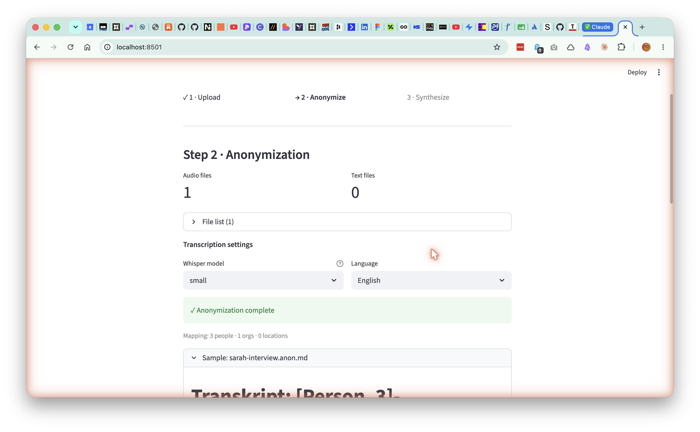

# Local Research Pipeline

Turn sensitive interview recordings into structured research syntheses, entirely on your Mac. No cloud, no API keys, nothing leaves the machine.

## Why this exists

User research often involves material that must not touch the cloud: interviews under NDA, banking compliance topics, anything covered by GDPR. Cloud transcription and cloud LLMs are off the table, so the synthesis work stays manual. Or it doesn't happen at all.

This pipeline runs the full path (audio → transcript → anonymization → synthesis) with local open-weight models instead.



## How it works

```
[ audio interview ]
        ↓  Whisper (faster-whisper, local)
[ transcript ]
        ↓  spaCy NER (local)
[ anonymized transcript + _key.json ]
        ↓  Ollama (local, qwen3:8b default)
[ structured 7-section synthesis ]
```

A Streamlit wizard on `localhost:8501` walks through the three steps and shows each intermediate result, so you can verify before continuing. See [`examples/`](examples/) for real output.

## Quickstart

Prerequisites: macOS, [Homebrew](https://brew.sh), Python 3.12 (`brew install python@3.12`), [Ollama](https://ollama.com) (`brew install ollama && brew services start ollama`).

```bash
git clone https://github.com/volkermaxmeyer/local-research-pipeline.git
cd local-research-pipeline
./setup.sh                  # venv + packages + spaCy models (~1.2 GB)
ollama pull qwen3:8b        # synthesis model (~5.2 GB)
./run.sh                    # opens localhost:8501
```

Then upload one of the synthetic test interviews from `test-data/` (no real people, generated with TTS), pick **English** and Whisper model **small**, and run the three steps. The first transcription downloads the Whisper model (~470 MB) once. After that everything runs offline.

## Models

| Model | Role | Notes |
|-------|------|-------|
| `qwen3:8b` | Synthesis (default) | Best quality; thinking mode disabled for clean output |
| `gemma3:4b` | Synthesis (fast) | ~3x faster, solid quality |
| `llama3.1:8b`, `gemma2:2b` | Synthesis (legacy) | Kept for comparison |
| faster-whisper `tiny` … `large-v3` | Transcription | `small` (~470 MB) is the default, enough for clear recordings |
| spaCy `de_core_news_lg` / `en_core_web_lg` | Anonymization | Picked automatically to match the transcript language |

## Output

Everything lands in a per-run working folder:

```
output/
  *.anon.md              # anonymized transcripts
  *.synthesis.md         # structured synthesis
  _key.json              # re-identification map (NEVER share, NEVER cloud-sync)
  raw-transcripts/
    *.md                 # raw Whisper transcripts
```

Re-runs are idempotent: already-transcribed files are skipped and the mapping is carried forward, so the same person gets the same token across files.

## Privacy by design

- The only network call the pipeline makes is to `localhost:11434` (Ollama). An eval criterion checks this explicitly.
- Anonymization replaces persons, organizations and locations with consistent placeholder tokens across files.
- The re-identification map (`_key.json`) never leaves the output folder on your machine. It is deliberately excluded from this repository.

## Known limits

- spaCy catches most names, but nicknames ("my boss Tobi"), unusual company names or lowercase locations can slip through. For highly sensitive interviews, review the `.anon.md` before synthesis. The UI shows it for exactly that reason.
- Whisper accuracy depends on audio quality; multi-speaker recordings with overlap produce mixed transcripts.
- Synthesis works on one interview at a time. There is no cross-interview clustering.
- macOS / Apple Silicon only.

## How this was built

This repo doubles as a product case study. The process behind it is documented in:

- [`docs/product-process.md`](docs/product-process.md): problem framing, users, scope, and the 12-criteria eval that drove development
- [`docs/decision-log.md`](docs/decision-log.md): key decisions with reasoning and evidence, including a measured model upgrade

## License

[MIT](LICENSE)
